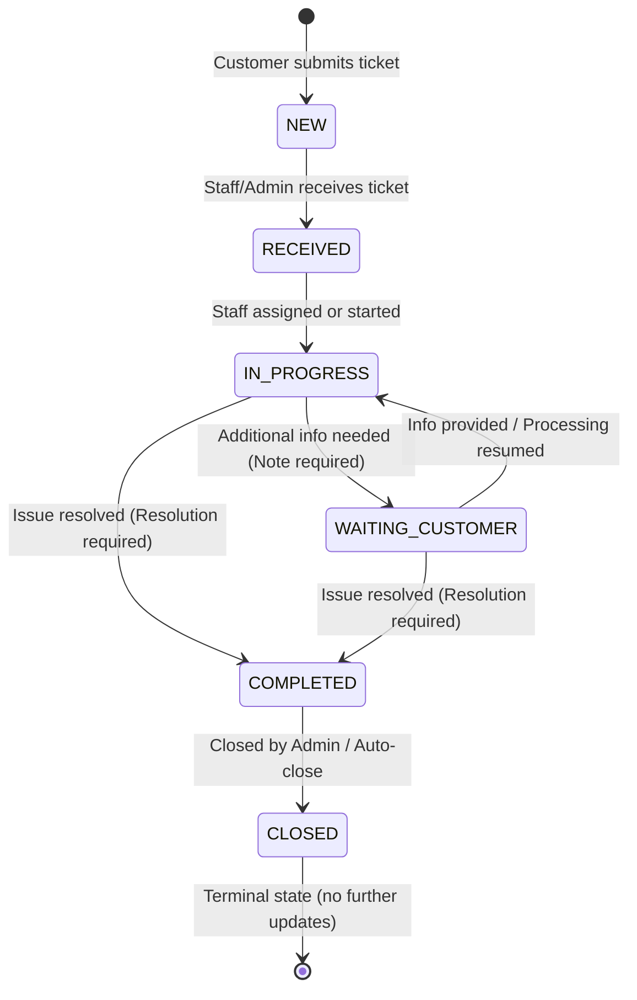

# TeleCare Support Request Workflow & Lifecycle Specification

## 1. State Machine Overview

The TeleCare Support Request Lifecycle follows a deterministic, state-driven workflow designed to guarantee clear ownership, SLA tracking, and auditability.

---

## 2. State Transition Matrix

| Current State (`oldStatus`) | Allowed Next States (`targetStatus`) | Conditions & Requirements |
|---|---|---|
| `NEW` | `RECEIVED` | Initial intake. Performed via `PATCH /receive`. Cannot be assigned before being received. |
| `RECEIVED` | `IN_PROGRESS` | Manual status change or triggered automatically upon assigning to an eligible staff member. |
| `IN_PROGRESS` | `WAITING_CUSTOMER` | Requires a non-empty `note` specifying what is needed from the customer. |
| `IN_PROGRESS` | `COMPLETED` | Requires a non-empty `resolution` detailing the solution provided. |
| `WAITING_CUSTOMER` | `IN_PROGRESS` | Resumes active processing. |
| `WAITING_CUSTOMER` | `COMPLETED` | Direct resolution. Requires non-empty `resolution`. |
| `COMPLETED` | `CLOSED` | Terminal archival. Marks `closedAt = now()`. |
| `CLOSED` | *None* | Closed tickets cannot be updated, transitioned, assigned, or noted. Returns HTTP 400. |

### No-Op Policy
If an admin sends a status update where `oldStatus == targetStatus`, the system executes a safe no-op: returns the current ticket details without adding a duplicate history log or triggering a redundant notification.

---

## 3. Assignment Business Rules

1. **Eligibility**:
   - Tickets can only be assigned to active users with role `ADMIN` or the `SUPPORT_REQUEST_PROCESS` permission.
   - Assigning to non-existent, inactive, or ineligible users returns HTTP 400 / 404 (`STAFF_NOT_ELIGIBLE` / `STAFF_NOT_FOUND`).
2. **Auto-transition**:
   - Assigning a ticket in `RECEIVED` state automatically transitions its status to `IN_PROGRESS` and generates an `ASSIGNED` history log.
   - Reassigning an already `IN_PROGRESS` ticket updates the assignee and logs the change without modifying the status.

---

## 4. Customer Ownership & Data Privacy

1. **Strict Ownership Verification**:
   - Every customer endpoint (`/support-requests/me`, `/support-requests/me/{id}`, `/support-requests/me/{id}/histories`) validates `customerId == currentAuthenticatedUser.id`.
   - Client-provided `customerId` parameters are strictly rejected.
2. **Resource Enumeration Prevention**:
   - If Customer A attempts to view a ticket owned by Customer B via `/support-requests/me/{id}`, the backend returns **HTTP 404 Not Found** (`SUPPORT_REQUEST_NOT_EXISTED`), rather than HTTP 403.
3. **Data Sanitization in Customer Timeline**:
   - Customer responses use separate DTOs (`CustomerSupportRequestDetailResponse`, `CustomerSupportRequestHistoryResponse`).
   - Internal processing notes (`NOTE_ADDED`) and internal staff IDs are excluded.
   - Customers only see milestone transitions: `CREATED`, `STATUS_CHANGED`, `WAITING_CUSTOMER` customer-facing notes, and final `resolution`.

---

## 5. Notification Triggering Rules

In-app notifications are persisted in PostgreSQL:

| Event | Recipient | Type | Content |
|---|---|---|---|
| `NEW -> RECEIVED` | Customer (owner) | `SUPPORT_REQUEST_RECEIVED` | "Yêu cầu hỗ trợ đã được tiếp nhận" |
| Status Change | Customer (owner) | `SUPPORT_REQUEST_STATUS_CHANGED` | "Yêu cầu hỗ trợ đã cập nhật trạng thái" |

### Suppression Rules:
Notifications are **NOT** created when:
- The transition fails or is rejected.
- The request is a no-op (`oldStatus == targetStatus`).
- An internal note is added (`NOTE_ADDED`).
- A ticket is reassigned without changing the status.
- A duplicate event key / `sourceHistoryId` is detected.

---

## 6. Concurrency & Ticket Code Generation

1. **Optimistic Locking**:
   - `SupportRequest` is protected with `@Version Long version`.
   - Concurrent updates by two administrators result in an `ObjectOptimisticLockingFailureException`, returned to the client as **HTTP 409 Conflict** (`SUPPORT_REQUEST_CONFLICT`).
2. **Ticket Code Format**:
   - Format: `SR-YYYYMMDD-XXXXX` (e.g. `SR-20261003-00001`).
   - Timezone: `Asia/Ho_Chi_Minh` (`ZoneId.of("Asia/Ho_Chi_Minh")`).
   - Sequence: Backed by database sequence `support_request_seq` with atomic logging on unexpected fallback.
